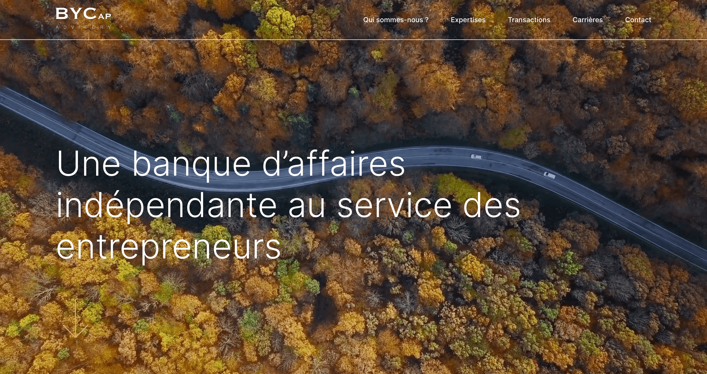

## 📍 Contexte

Thème wordpress sur-mesure | Premier site développé au sein de l'agence Digital Cover (2023).

À partir d'une maquette (Figma), j'ai été en charge de tout le reste: intégration, développement, animations, mise en ligne.

## ⚙ Stack

**Développement**
- Sage / Laravel Blade (PHP templating)
- Bootstrap (uniquement pour la grille - container / row / col)
- Javascript (ES6)
- Scss (méthode bem)
- Webpack

**Librairies**
- Lenis
- Taxi
- Gsap
- Splitting

**Wordpress**
- ACF
- CPT UI
- Gravity Form

**Autre(s)**
- Gitlab
- FileZila
- SSH
- OVH

## 👀 Showcase

Exemples de blocks/composants/animations entièrement développés par mes soins:

## [Équipe (modal + slider)](https://github.com/idrissdiakite/bycap-wp-gsap/tree/main/team-members)

**Description** 

<a href="https://www.youtube.com/watch?v=n8dcZ58DhBM" target="_blank">demo</a>

## [Tombstones (flip cards)](https://github.com/idrissdiakite/bycap-wp-gsap/tree/main/tombstones)

**Description** 

Animation expressement demandée par le client: lorsqu'on survole une card, celle ci rotate sur elle même afin d'afficher son coté "verso". 
Pour cela, j'ai créé une card composée de deux divs: une pour le front, une pour le back à laquelle j'ai appliqué un *rotateY(180deg)*. L'astuce pour obtenir l'animation souhaitée a été d'appliquer la propriété **backface-visibility: hidden** à la card. Coté js, j'ai simplement ajouté une fonction afin de toggle la classe **show-back** lorsqu'on clique sur card (uniquement sur mobile).

<a href="https://www.youtube.com/watch?v=IBsneJmI-bw" target="_blank">demo</a>

## [Scroll horizontal](https://github.com/idrissdiakite/bycap-wp-gsap/tree/main/horizontal-scroll)

**Description** 

<a href="https://www.youtube.com/watch?v=Ih7O6hxIVHA" target="_blank">demo</a>

## [Chiffre clé](https://github.com/idrissdiakite/bycap-wp-gsap/tree/main/key-figure)

**Description** 

## 💫 Live

[https://by-cap.com/](https://by-cap.com/)
